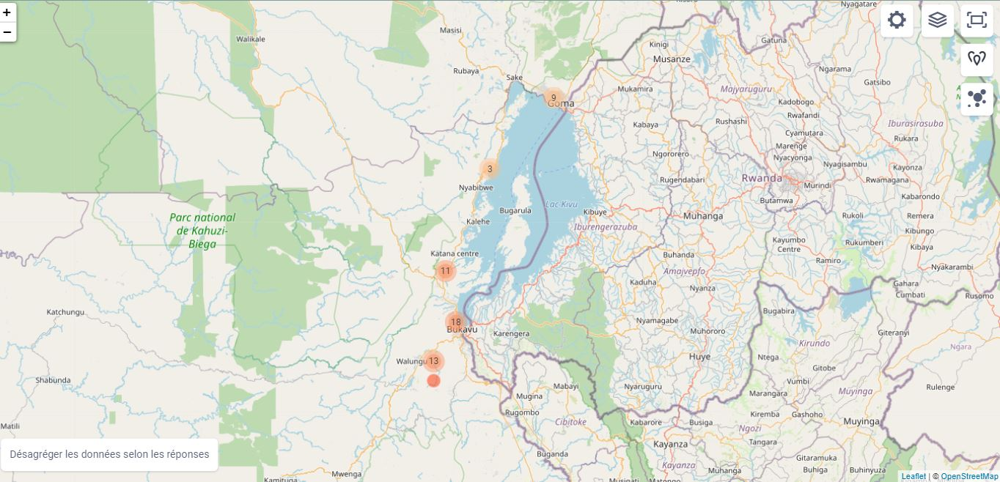

--- 
title: "Etude Finale SPR"
author: "Innovations & Entreprenariat Social"
date: "`r Sys.Date()`"
site: bookdown::bookdown_site
documentclass: book
bibliography: [book.bib, packages.bib]
biblio-style: apalike
link-citations: yes
description: "Rapport d'Etat de Collect et d'analyse des données sur le Cohésion Sociale"
---


<!--chapter:end:index.Rmd-->

# Introduction

Ce site nous permettra de suivre en temps réel la situation de récolte et d'analyse des données en cours de reolcte

Il constitue un moyen de vérification à temps réel de l'évalution de collecte, de l'assurance qualité des donnnes et de la performance des activités sur terrain.

```{r echo=FALSE,include=FALSE,message=FALSE}
#file.create('.nojekyll')
```


<!--chapter:end:01-intro.Rmd-->

# Data Monitoring


```{r setup, include=FALSE,echo=FALSE,message=FALSE,warning=FALSE}
knitr::opts_chunk$set(echo = TRUE)
library(httr)
library(jsonlite)
library(readr)
library(readxl)
library(openxlsx)
library(tidyverse)
library(lubridate)
library(knitr)
library(kableExtra)
library(questionr)
library(dlookr)
library(gt)
library(gtsummary)
library(broom)
```


```{r echo=FALSE,message=FALSE,include=FALSE,message=FALSE,warning=FALSE}
theme_gtsummary_language(language = "fr")
theme_gtsummary_mean_sd(set_theme = T)
theme_gtsummary_printer(print_engine = "kable",set_theme = T)
theme_gtsummary_journal(journal = "lancet")
```

```{r server, echo=FALSE,include=FALSE}
url <- "https://kc.kobotoolbox.org/api/v1/data/720001.csv"
u <- "mulekya_schad"
pw <- "ms4575i2020"
Rawdata <- GET(url=url,authenticate(user=u,password = pw),progress())
```


```{r echo=FALSE,include=FALSE,message=FALSE}
Rawdata
str(Rawdata)
```
```{r include=FALSE,message=FALSE,echo=FALSE}
d_content <- content(Rawdata,"raw",encoding = "UTF-8")
d_content_csv <- read_csv(d_content)

names(d_content_csv)

```
## Carte de l'enquete

Image construite suite aux points géographiques recoltées dans l'Etude Finale sur la Cohésion Sociale du Projet SPR

## Analyse des donnes

```{r echo=FALSE}
SPR_data <- as.data.frame(d_content_csv)
```


```{r echo=FALSE}
SPR_data <- SPR_data %>% select(-"__version__",-"_tags",-duree)
```

création de la variable durée
```{r calcul_duree_enquete,echo=FALSE, include=FALSE}
SPR_data <- SPR_data %>% mutate(temps=end-start)
SPR_data
SPR_data <- SPR_data %>% relocate(temps)
SPR_data <- SPR_data %>% mutate(temps=as.character(temps),
                                temps=as.numeric(temps),
                                temps=format(temps,scientific=FALSE,digits=0))
SPR_data
```

Analyse des durée d'enquete pour le premier Jour
```{r echo=FALSE, include=FALSE}
SPR_data <- SPR_data %>% rename(
  date_enq="Renseignement_general/date_enq")
names(SPR_data) <- names(SPR_data) %>% str_remove_all("Renseignement_general/")

```


```{r suppression_variables_inutiles,echo=FALSE,include=FALSE}
SPR_data <- SPR_data %>% filter(Version==1)
SPR_data <- SPR_data %>% select(-Localisation,-"_Localisation_altitude",-"_Localisation_longitude",-"_Localisation_precision",-"_Localisation_latitude",-"_uuid",-"_validation_status",-Version,-num_phone,-"_notes",-"_submission_time")
SPR_data <- SPR_data %>% select(-`meta/instanceID`)

```


```{r nos_variables,echo=FALSE,include=FALSE}
names(SPR_data) <- names(SPR_data) %>% str_remove_all("situation_sociodemographique/")
names(SPR_data) <- names(SPR_data) %>% str_remove_all(pattern = "Id_groupe_ethniqu/")
names(SPR_data) <- names(SPR_data) %>% str_remove_all(pattern = "Dimension")
names(SPR_data) 
```


```{r echo=FALSE,include=FALSE}

SPR_data$nom_enqueteur <- SPR_data$nom_enqueteur %>% str_to_lower() %>% str_remove_all("OLUHYA")

SPR_data$nom_enqueteur <- SPR_data$nom_enqueteur %>% str_replace_all("è","e")
SPR_data
SPR_data$nom_enqueteur <- SPR_data$nom_enqueteur %>% str_replace_all("irene munyerenkana","irene")
SPR_data$nom_enqueteur <- SPR_data$nom_enqueteur %>% str_replace_all("iragi zihalirwa eloi","iragi")
SPR_data$nom_enqueteur <- SPR_data$nom_enqueteur %>% str_replace_all("imani iragi olivier","iragi olivier")
SPR_data$nom_enqueteur <- SPR_data$nom_enqueteur %>% str_replace_all("ohirwe'oluhya nankafu","ohirwe")
SPR_data$nom_enqueteur <- SPR_data$nom_enqueteur %>% str_replace_all("prudent murhula shanvu","prudent murhula")


SPR_data$nom_enqueteur <- SPR_data$nom_enqueteur %>% str_replace_all("ohirwe'","ohirwe oluhya")
SPR_data$nom_enqueteur <- SPR_data$nom_enqueteur %>% str_replace_all("ohirwe","ohirwe oluhya")
SPR_data$nom_enqueteur <- SPR_data$nom_enqueteur %>% str_replace_all("ohirwe oluhya oluhya","ohirwe oluhya")


```


```{r realisation_site,echo=FALSE}
SPR_data %>% group_by(Province,Territoire) %>% count(Province,Territoire) %>% 
  mutate(Territoire_Commune=case_when(Territoire=="n/a" & Province=="Nord-Kivu"~"Goma",Territoire=="n/a" & Province=="Sud-Kivu"~"Bukavu",TRUE~Territoire)) %>% relocate(Territoire_Commune,.before = n) %>% select(Province,Territoire_Commune,n) %>% relocate(Territoire,.after = Province) %>% mutate(assignation=101) %>% mutate(Pourcentage=n*100/assignation) %>% 
  kable(caption = "Réalisations Par Groupement/commune ",digits = 0,align = "c") %>% 
  row_spec(0,background = "blue")
```

```{r echo=FALSE, include=FALSE}
SPR_data <- SPR_data %>% mutate(temps=as.numeric(temps))
SPR_data %>% distinct(nom_enqueteur)

```
Temps moyen par enqueteur

```{r Situation_enqueteur,echo=FALSE}
SPR_data %>% group_by(nom_enqueteur,Village,date_enq) %>% summarise(temps_moyen=mean(temps)) %>% kbl() %>% kable_styling(full_width = TRUE)
SPR_data$nom_enqueteur <- factor(SPR_data$nom_enqueteur)
```


```{r echo=FALSE,include=FALSE}
glimpse(SPR_data)
```


```{r exportxl, include=FALSE,echo=FALSE}
write.xlsx(SPR_data,file="SPR_data.xlsx")
```

```{r echo=FALSE,include=TRUE}
attach(SPR_data)
Realisation_par_enqueteur <- SPR_data %>% group_by(nom_enqueteur,Village) %>% count(nom_enqueteur)
write.xlsx(Realisation_par_enqueteur,"Realisation_par_enqueteur.xls",format = "xls")

SPR_data$Village <- factor(SPR_data$Village)
SPR_data$nom_enqueteur <- factor(SPR_data$nom_enqueteur)

```

```{r echo=FALSE,include=FALSE}
freq(SPR_data$`Margin_group/Handicaps_obseves/1`)
freq(SPR_data$Sexe)
freq(SPR_data$`Margin_group/Handicaps_obseves/9`)
```
## Résumé des données récoltées désagrégées selon le sexe des enquetés

```{r Resume_base_des_donnes,echo=FALSE}
SPR_data %>% select(-start,-end,-`PID/PID_12a_1`)%>% 
  gtsummary::tbl_summary(by = Sexe,missing = "no",sort = list(everything()~"frequency"))
```
```{r echo=FALSE}
Prudent <- SPR_data %>% filter(nom_enqueteur=="prudent murhula") %>% select(start,end,temps,Territoire,Village)
Prudent %>% kbl(caption = "Zoom sur Prudent",align = "c") %>% 
  column_spec(3,color = "white",                                                                             background = spec_color(SPR_data$temps[1:22] ,end = 1),
              popover = paste("am",SPR_data$temps[1:22] )) %>% 
  row_spec(0,background = "red")
                                                                                                                                                                       
```


```{r echo=FALSE}
SPR_data %>% group_by(nom_enqueteur,Province,date_enq) %>% count(nom_enqueteur) %>% kable(caption = "Nombre d'enquetes par site et par enqueteur et par date")
```


## Temps d'enquête selon les enqueteurs

```{r echo=FALSE}
SPR_data %>% ggplot()+aes(y=nom_enqueteur,x=temps,color=date_enq) + geom_boxplot(color="black")+geom_jitter()+
  theme_bw()+
  labs(y="Nom Enqueteur",x="Durée d'enquete",title = "Durée d'enquête par enqueteur",subtitle = "Boxplots")
```
De ce graphique, nous remarquons que le temps d'enquête diminue aussi la date avance 


```{r echo=FALSE,include=FALSE,message=FALSE}
SPR_data %>% diagnose_category()
SPR_data %>% diagnose_numeric()
```

```{r}
table(date_enq)
```


```{r}
SPR_data <- SPR_data %>% mutate(Jour=case_when(date_enq=="2021-07-04"~"Jour1",
                          date_enq=="2021-07-05" ~"Jour2",                                               date_enq=="2021-07-07"~"Jour3",
                                               TRUE~"Jour4"))
freq(SPR_data$Jour,cum=T)
```


<!--chapter:end:02-literature.Rmd-->

# Methodologie

## Méthodologie de Collecte des Données


## Méthodologie d'analyse

<!--chapter:end:03-method.Rmd-->

# Analyse des données


## Description des Données

## Construction des indicateurs du Projet

## Construction des indicateurs de Cohésion Sociale

<!--chapter:end:04-application.Rmd-->

# Conclusion

<!--chapter:end:05-summary.Rmd-->

`r if (knitr::is_html_output()) '
# References {-}
'`

<!--chapter:end:06-references.Rmd-->

